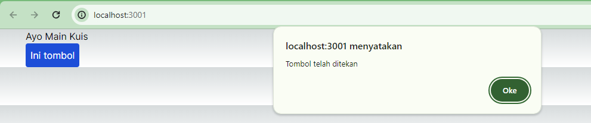
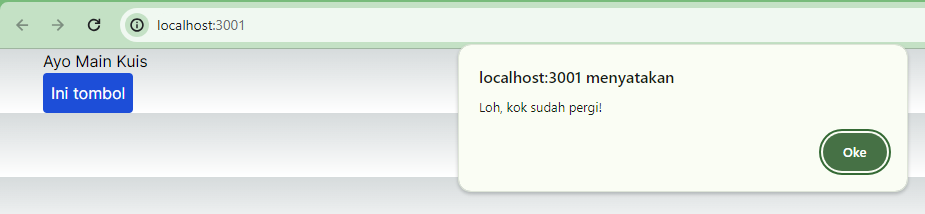
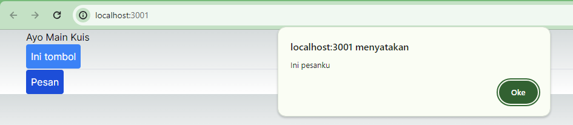
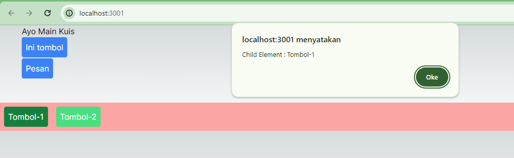
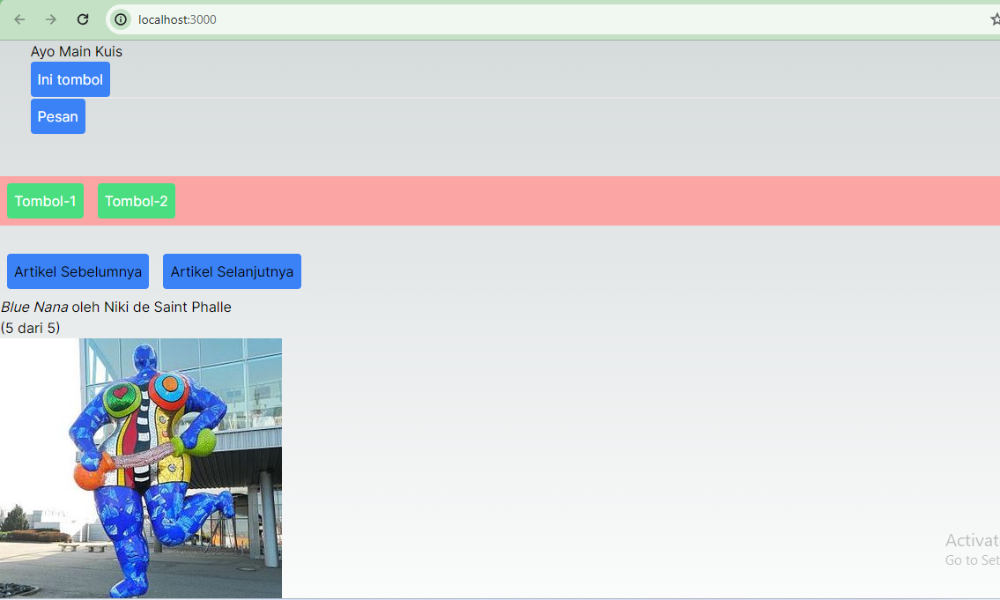
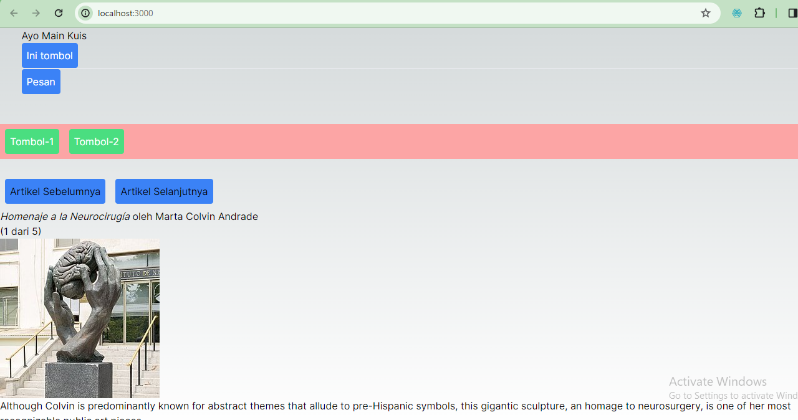
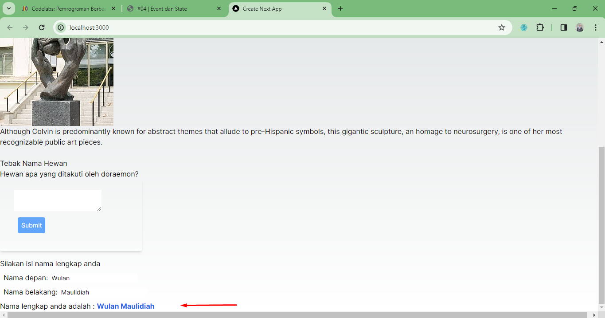

This is a [Next.js](https://nextjs.org/) project bootstrapped with [`create-next-app`](https://github.com/vercel/next.js/tree/canary/packages/create-next-app).

## Getting Started

First, run the development server:

```bash
npm run dev
# or
yarn dev
# or
pnpm dev
# or
bun dev
```

Open [http://localhost:3000](http://localhost:3000) with your browser to see the result.

## Laporan Praktikum Minggu Keempat
1. Hasil ketika kursor Tombol_1 ditekan

Hasil  ketika pop up ditekan


2. Hasil ketika Tombol_2 ditekan


3. Hasil ketika Tombol-1 ditekan


4. Saat kita menekan tombol "Artikel Selanjutnya" sebanyak lebih dari 5 kali atau lebih dari jumlah halaman artikel maka akan muncul kode error, hal ini bisa terjadi karena terdapat kondisi yang menghentikan nilai index terus ditambah. Oleh karena itu dibuat sebuah kondisi yang mana tombol "Artikel Selanjutnya" hanya bisa dijalankan apabila indexnya kurang dari 4. Begitupun dengan tombol "Artikel Sebelumnya" hanya dapat dijalankan jika kondisi indexnya lebih dari 0 atau posisinya pada halaman pertama.



5. 1) Perbedaan dari kedua program Form_2 yang pertama dan kedua terletak pada penggunaan state "fullname". Kode pertama menggunakan state terpisah untuk state "firstName", "lastName", dan "fullName". Sedangkan kode kedua menggunakan variabel lokal "fullname" yang akan diperbarui jika ada perubahan pada "firstName" dan "lastName" serta akan menyimpan value yang diisi oleh state "firstName" + "lastName" dan kemudian menampilkannya.
    2) Saat menggunakan state "fullName" terjadi kondisi asinkronus atau ketidakcocokan antara value yang ada pada state "firstName" dan state "lastName" dengan yang diharapkan pada state "fullName". Dengan demikian, jika kita menghilangkan state "fullName" kita menghindari masalah asinkronus tersebut dan membuat kode program kita lebih sederhana. 
    

6. 

## Deploy on Vercel

